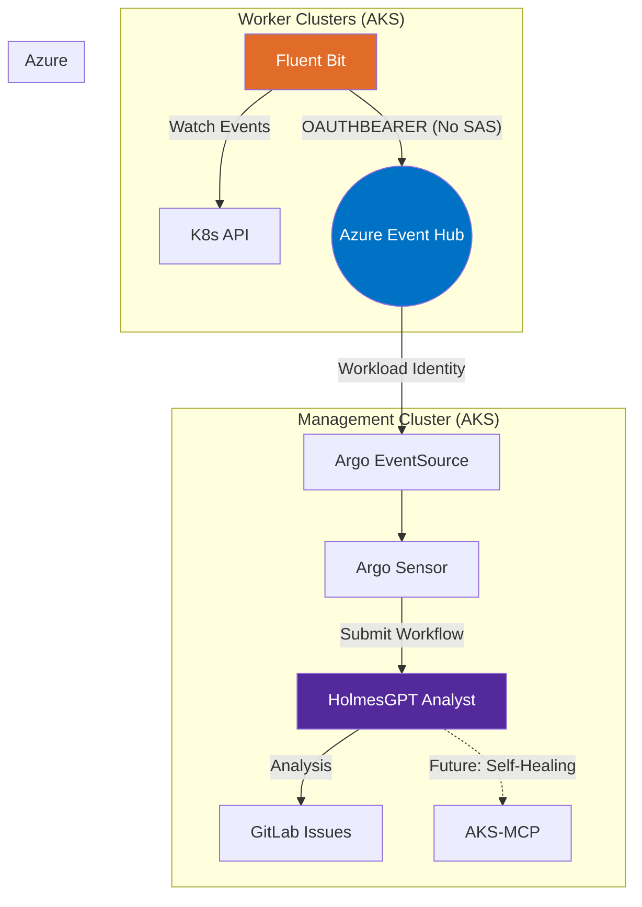
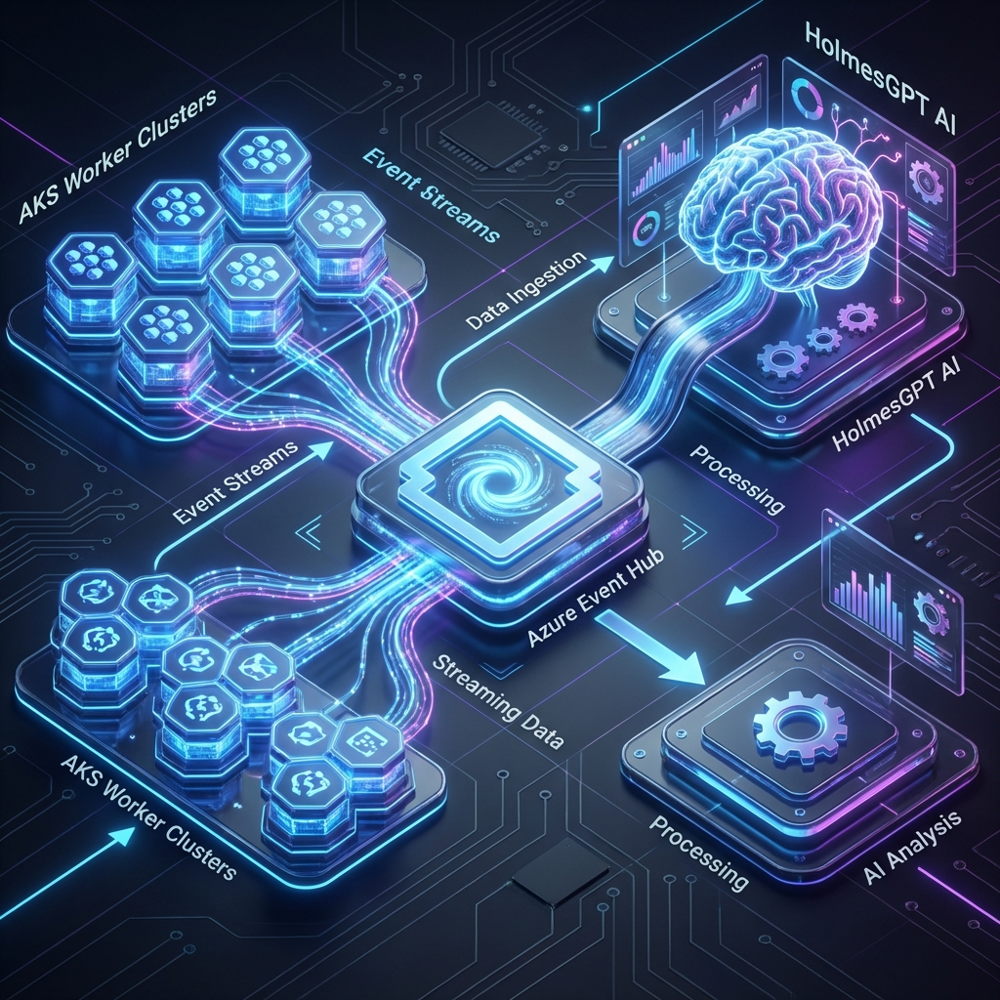
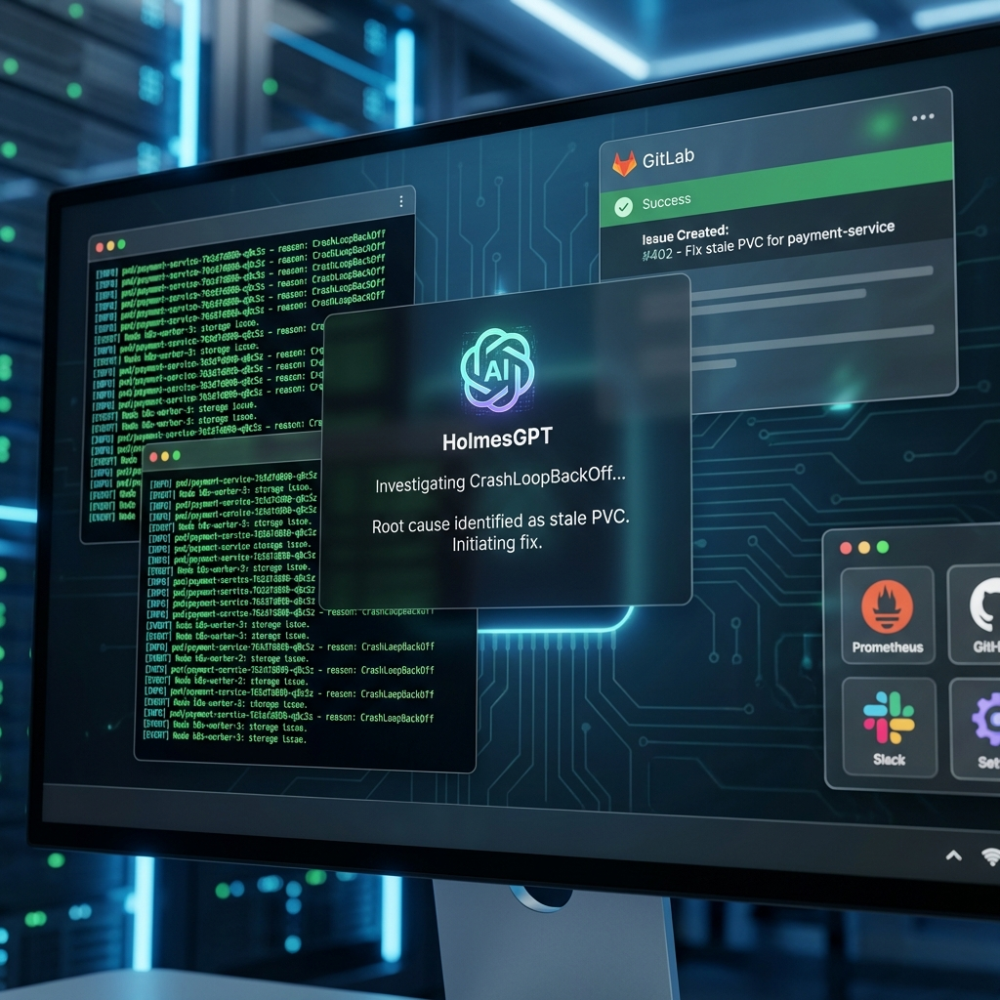
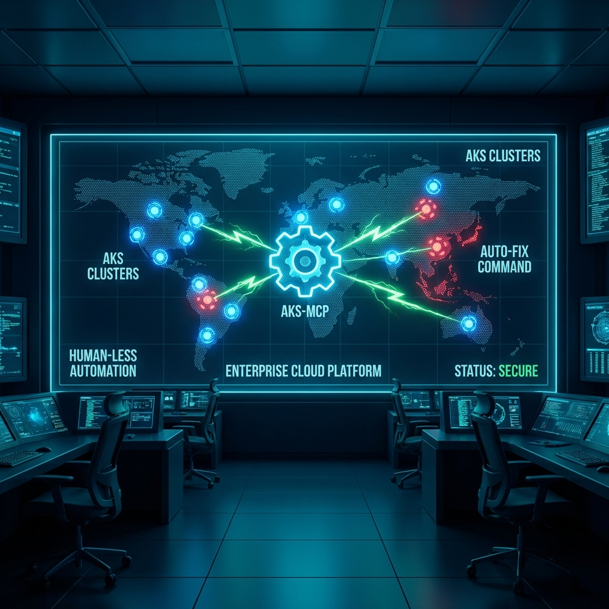

# 🚀 Enterprise Multi-Cluster Event Pipeline: Fluent Bit + HolmesGPT

Deploy a premium, production-ready Kubernetes event monitoring and autonomous remediation pipeline on **Azure Kubernetes Service (AKS)**. This architecture leverages **Azure Workload Identity** for a secret-less, secure transport layer via **Fluent Bit** and **Azure Event Hub**.





## 🌟 The Vision: Zero-Touch Incident Response

This pipeline transforms Kubernetes events from "background noise" into **actionable intelligence**. By integrating **HolmesGPT** (AI Agent) directly into the event stream, we eliminate the need for manual triage.

### 🔄 The Automated Flow

1.  **⚡ Event Generation**: An issue occurs in a worker cluster (e.g., `ImagePullBackOff`, `FailedScheduling`).
2.  **🚚 Intelligent Shipping**: **Fluent Bit** (using enterprise-grade `rdkafka`) watches the Events API, filters for `Warnings`, and streams them to **Azure Event Hub** using **OAUTHBEARER** (Workload Identity).
3.  **🧠 Central Nervous System**: On the Management Cluster, **Argo Events** consumes the stream and triggers an **AI Triage Workflow**.
4.  **🔍 Autonomous Investigation**: **HolmesGPT** is spawned. It uses its AI capabilities to investigate the cluster, analyze logs, and determine the root cause.
5.  **📝 GitLab Orchestration**: HolmesGPT creates a **GitLab Issue** automatically, containing:
    *   A summary of the incident.
    *   The raw evidence (logs/events).
    *   **Step-by-step instructions** for the fix.

> [!IMPORTANT]
> **No Human Interaction Required**. Triaging happens in seconds, meaning by the time an engineer sees the notification, the solution is already written.

---

## 🛠️ Architecture & Security



### Security First (No SAS Tokens)
Unlike standard implementations, this setup is designed for strict enterprise environments:
*   **Workload Identity**: Services authenticate using Managed Identities.
*   **Passwordless**: No SAS tokens or connection strings are stored in Kubernetes secrets.
*   **Least Privilege**: Identities are scoped specifically to `Data Sender` (Fluent Bit) and `Data Receiver` (Argo).

### Key Components
| Component | Role | Details |
| :--- | :--- | :--- |
| **Fluent Bit** | Event Shipper | High-performance agent with `kubernetes_events` input. |
| **Azure Event Hub** | Central Collector | Scalable message hub with Kafka interface enabled. |
| **Argo Events** | Event Bus | Orchestrates the bridge between Event Hub and Workflows. |
| **HolmesGPT** | AI Analyst | The brain that investigates and triages the root cause. |

---

## ⚖️ Why Event Hub vs. Log Analytics?

Your boss or architect might suggest using **Azure Log Analytics (Azure Monitor)** for event collection. Here is why we chose the **Fluent Bit + Event Hub** path:

| Feature | Log Analytics Export | Fluent Bit + Event Hub |
| :--- | :--- | :--- |
| **End-to-End Latency** | **5 - 15 Minutes** (Batching) | **< 5 Seconds** (Streaming) |
| **Use Case** | Forensic Search / Long-term Storage | **Real-Time AI Remediation** |
| **Triggering** | Requires Polling or Logic Apps | Native Integration with Argo Events |
| **Operational Control** | Proprietary "Diagnostic Settings" | Open-standard (Fluent Bit/librdkafka) |
| **Cost at Scale** | High (Ingest + Export fees) | Low (Pay per throughput) |

### The "Stale Investigation" Problem
AI-driven remediation (HolmesGPT) relies on **fresh evidence**. If an investigation starts 15 minutes after an event occurs:
*   The problematic Pod might have already been restarted or deleted by a Deployment controller.
*   The log buffer might have rolled over.
*   The transient error that caused the root cause might have vanished.

**Our Choice**: We prioritize **Actionable Speed** over "Log Cold Storage."

---

## 🚀 Quick Start: Deployment

### 1. Provision Infrastructure
Run the automated setup script to create the Event Hub and configure identities.
```bash
chmod +x 00-setup-workload-identity.sh
./00-setup-workload-identity.sh
```

### 2. Configure Agent
Update `02-fluent-bit-deployment.yaml` with the `AZURE_CLIENT_ID` and `AZURE_TENANT_ID` output by the script.

### 3. Deploy Stack
```bash
kubectl apply -f 01-fluent-bit-config.yaml
kubectl apply -f 02-fluent-bit-deployment.yaml
kubectl apply -f 03-eventsource-workload-identity.yaml
```

---

## 🔮 The Future: Autonomous Remediation (AKS-MCP)

The next evolution of this project is moving from **Investigation** to **Healing**.



We are integrating the **AKS-MCP (Model Context Protocol)** server. This allows HolmesGPT to not just *suggest* a fix, but safely *apply* it.

*   **Self-Healing**: HolmesGPT can automatically restart stale deployments or clear stuck PVCs.
*   **Policy-Gated**: Only "allowed" commands will be executed, ensuring the AI operates within safe boundaries.
*   **Full Audit Trail**: Every action taken by the AI is logged back to the GitLab ticket for review.

---
---
*Built with ❤️ for High-Scale Production Environments.*

> [!TIP]
> **Engineers & DevOps**: For detailed manual commands, troubleshooting, and configuration specs, refer to the [Technical Implementation Guide](./README.md).
