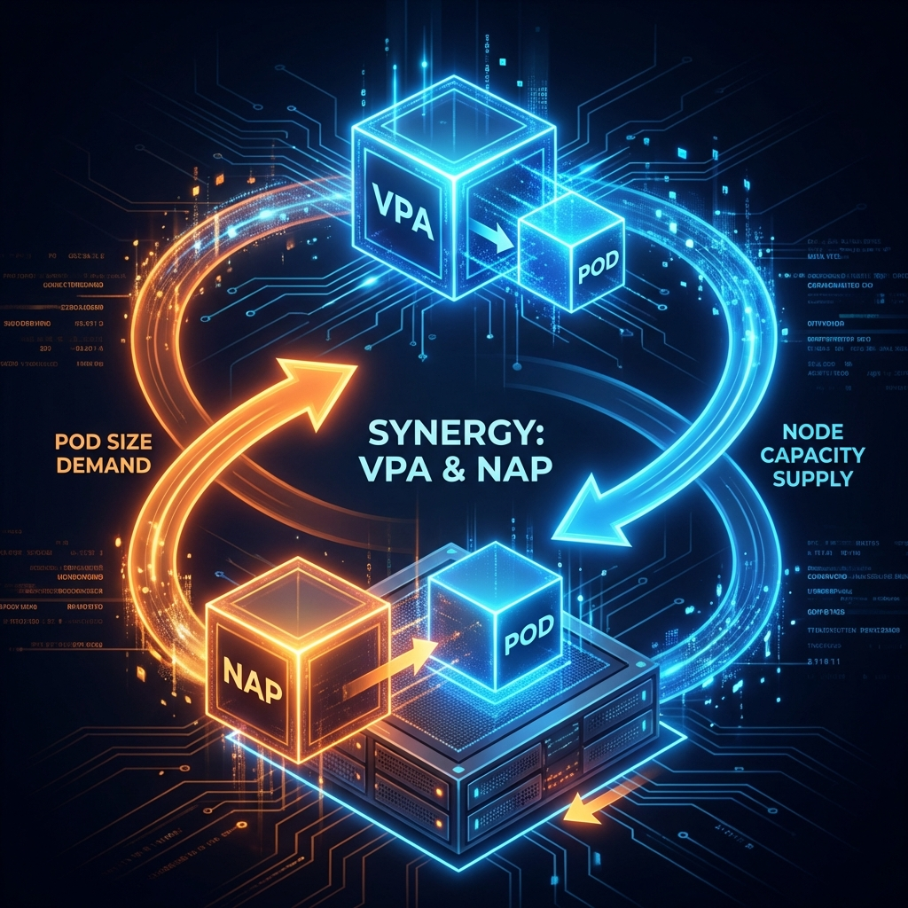
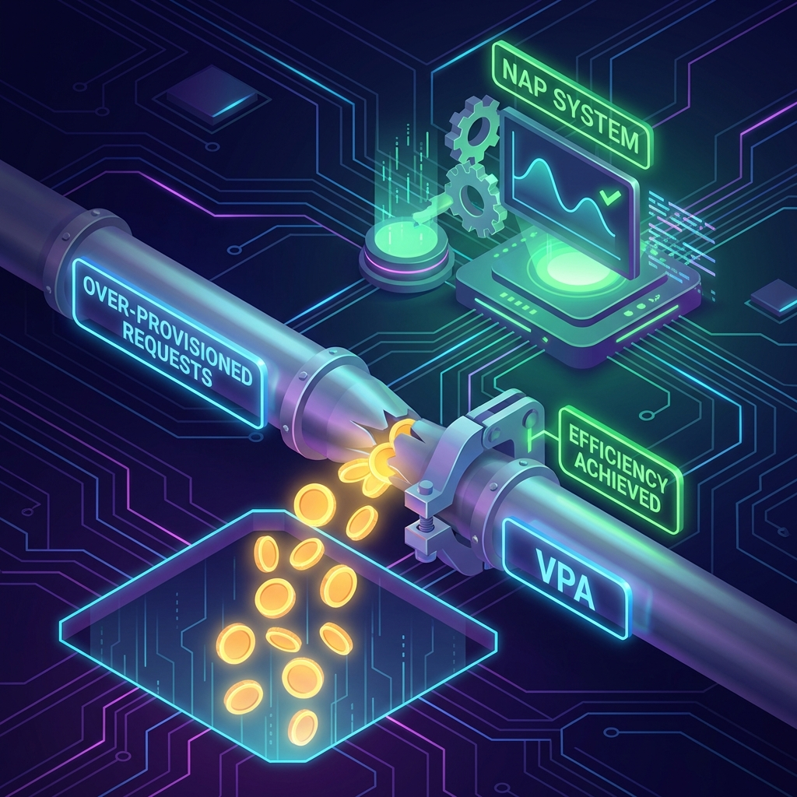
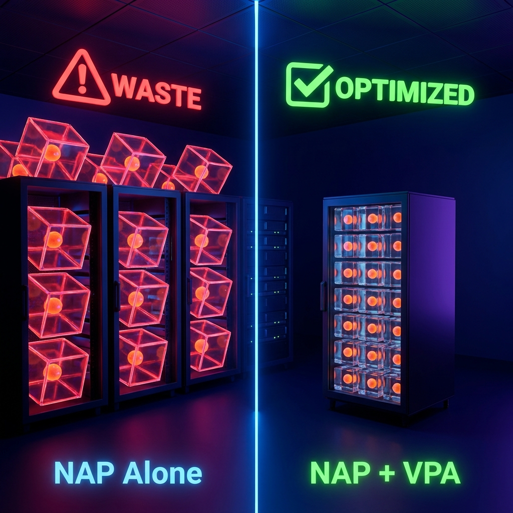

# Benefits & Cost Savings: VPA + NAP Synergy



## Overview

Combining **Vertical Pod Autoscaler (VPA)** with **Node Auto Provisioning (NAP)** creates a powerful, self-optimizing feedback loop that maximizes cluster efficiency and minimizes cloud spend.

While **NAP** ensures we have the *right nodes* for our pods, **VPA** ensures we have the *right size* for our pods. Together, they eliminate waste at both the infrastructure and application layers.

---

## 💡 The Problem: "NAP without VPA is a Money Leak"



While **NAP (Node Auto Provisioning)** is excellent at providing infrastructure instantly, it is fundamentally "blind" to the efficiency of the workloads it supports. It trusts what the developers ask for.

**If developers ask for 4x more CPU than they need, NAP will dutifully provision 4x more infrastructure than required.** This makes NAP alone potentially dangerous to your budget:

1.  **Blind Scaling**: NAP scales based on *Requests*, not Usage.
2.  **Magnified Waste**: If one pod wastes 500m of CPU, and NAP scales it to 100 replicas, you are now paying for 50 CPU cores of pure air.
3.  **False Saturation**: Your cluster looks full (Requests are high), but your nodes are idle (Usage is low).

---

## 🚀 The Solution: VPA + NAP Synergy



### 1. VPA Stops the Leak
VPA acts as the "truth teller." It looks at the actual metrics of the container and rewrites the request to match reality.
*   *Before VPA*: Request: 2000m, Usage: 200m. **NAP provisions a 2-core node.**
*   *After VPA*: Request: 250m, Usage: 200m. **NAP fits this on a fractional slice of a node.**

### 2. NAP Capitalizes on the Savings
Once VPA shrinks the "box" (the pod request), NAP immediately identifies that it can use smaller nodes or consolidate multiple pods onto fewer nodes.
*   **Result**: You stop paying for "air" and start paying only for what runs your business.

### 3. The Feedback Loop
1.  **VPA** shrinks bloated pods.
2.  **NAP** detects empty space on nodes due to smaller pods.
3.  **NAP** consolidates workloads and terminates expensive, underutilized nodes.

---

## 💰 Cost Savings Breakdown

| Area | NAP Alone (High Risk) | NAP + VPA (Optimized) | Savings Potential |
| :--- | :--- | :--- | :--- |
| **CPU Requests** | Static, typically **50-200% over-provisioned** to be "safe". | Dynamic, typically within **10-20%** of actual usage. | **30-50% reduction** in core hours. |
| **Node Utilization** | Nodes are "full" of requests but empty of usage (**low ROI**). | Nodes are filled with actual work, maximizing hardware value. | **Half the nodes** required for same workload. |
| **Correction Speed** | Manual tuning (slow, reactive). | Automated tuning (instant, proactive). | **Zero** engineering hours spent on tuning. |

---

## 🛡️ Performance & Reliability Benefits

Cost isn't the only advantage. This combination also drastically improves reliability:

*   **Eliminate OOMKilled**: VPA detects if a pod is using *more* memory than requested and increases the limit automatically, preventing crashes.
*   **Unthrottled CPU**: VPA ensures CPU-hungry workloads get the reservations they need, preventing throttling during spikes.
*   **Faster Scheduling**: Smaller, accurate pods are easier for NAP to schedule than large, bloated ones.

---

## 📊 VPA Configuration & Modes

### VPA Update Modes

Understanding VPA modes is critical for safe rollout:

| Mode | Behavior | Status |
|:-----|:---------|:-------|
| **`Off`** | Only generates recommendations, no changes applied | Allowed (evaluation only) |
| **`Initial`** | Sets resources only at pod creation | **Recommended** |
| **`Recreate`** | Evicts pods when recommendations change significantly | **Blocked** |
| **`Auto`** | Currently same as Recreate, future in-place updates | **Blocked** |

> **⚠️ Platform Policy:** Only `Initial` and `Off` modes are permitted on uk8s clusters.
>
> `Auto` and `Recreate` modes are blocked because they can cause:
> - **Unexpected pod restarts** during business hours
> - **Service disruption** when multiple pods are evicted simultaneously
> - **Race conditions** with HPA scaling decisions
> - **Cascading failures** in tightly-coupled services
>
> With `Initial` mode, resource changes only apply when pods are naturally recreated (deployments, scaling, node drain), giving teams control over when changes take effect.

### Example VPA Configuration

```yaml
apiVersion: autoscaling.k8s.io/v1
kind: VerticalPodAutoscaler
metadata:
  name: my-app-vpa
  namespace: my-namespace
spec:
  targetRef:
    apiVersion: apps/v1
    kind: Deployment
    name: my-app
  updatePolicy:
    updateMode: "Initial"  # Only Initial or Off permitted
  resourcePolicy:
    containerPolicies:
      - containerName: "*"
        minAllowed:
          cpu: 50m
          memory: 64Mi
        maxAllowed:
          cpu: 4
          memory: 8Gi
        controlledResources: ["cpu", "memory"]
```

### Setting Resource Bounds

Always define `minAllowed` and `maxAllowed` to prevent VPA from:
- **Going too low**: Starving your application during traffic spikes
- **Going too high**: Defeating the purpose of optimization

---

## ⚠️ VPA + HPA Conflict Warning

**Do not use VPA and HPA on the same metric (CPU).** They will fight each other:
- HPA scales replicas based on CPU utilization
- VPA adjusts CPU requests, changing the utilization percentage

**Recommended Pattern:**
```yaml
# Use VPA for memory only
resourcePolicy:
  containerPolicies:
    - containerName: "*"
      controlledResources: ["memory"]  # CPU managed by HPA

# Use HPA for CPU-based horizontal scaling
apiVersion: autoscaling/v2
kind: HorizontalPodAutoscaler
spec:
  metrics:
    - type: Resource
      resource:
        name: cpu
        target:
          type: Utilization
          averageUtilization: 70
```

---

## ⚙️ Automated Implementation

We utilize **Kyverno** ClusterPolicies to automatically apply VPA configurations to workloads across the entire cluster, ensuring consistent optimization without manual intervention.

### Automatic Rollout & Exclusions
*   **Default Behavior**: VPA is automatically attached to all eligible Deployments and StatefulSets in all namespaces.
*   ♨️ **Java Workload Exception**: Due to how the JVM interacts with dynamic memory resizing, **Java containers are automatically excluded** from VPA policies to prevent stability issues.
*   **Opt-Out Mechanism**: Application teams can explicitly opt-out of VPA automation if their workload has specific static requirements using a label.

> **To opt-out, apply the following label to your workload:**
> ```yaml
> metadata:
>   labels:
>     vpa-skip: "true"
> ```

---

## 🔍 Verifying VPA is Working

### Check VPA Recommendations

```bash
# View VPA status and recommendations
kubectl describe vpa <vpa-name> -n <namespace>

# Quick view of all VPAs and their modes
kubectl get vpa -A -o custom-columns=\
'NAMESPACE:.metadata.namespace,NAME:.metadata.name,MODE:.spec.updatePolicy.updateMode,TARGET:.spec.targetRef.name'
```

### Compare Recommendations vs Actual

```bash
# See current pod resource usage
kubectl top pods -n <namespace>

# Compare with current requests
kubectl get pods -n <namespace> -o custom-columns=\
'NAME:.metadata.name,CPU_REQ:.spec.containers[0].resources.requests.cpu,MEM_REQ:.spec.containers[0].resources.requests.memory'
```

### Sample VPA Status Output

```yaml
Status:
  Recommendation:
    containerRecommendations:
      - containerName: my-app
        lowerBound:     # Minimum safe resources
          cpu: 25m
          memory: 128Mi
        target:         # Recommended resources (VPA applies this)
          cpu: 100m
          memory: 256Mi
        upperBound:     # Maximum expected need
          cpu: 500m
          memory: 1Gi
```

---

## 🔧 Troubleshooting

| Symptom | Cause | Solution |
|:--------|:------|:---------|
| VPA not updating pods | `updateMode: Off` | Change to `Initial` (updates apply on next pod restart) |
| VPA rejected by admission | Using `Auto` or `Recreate` mode | Change to `Initial` (platform policy) |
| Pods constantly restarting | Bounds too aggressive | Increase `minAllowed` values |
| Recommendations stuck at initial | Not enough metrics history | Wait 24-48 hours for stabilization |
| VPA shows no recommendations | Target deployment not found | Verify `targetRef` matches exactly |
| Memory keeps increasing | Possible memory leak in app | Investigate application, not VPA |
| Java app crashing after resize | JVM heap not adjusting | Exclude with `vpa-skip: "true"` label |

### Common Issues

**1. VPA Recommender Not Running**
```bash
kubectl get pods -n kube-system | grep vpa
# Ensure vpa-recommender, vpa-updater, vpa-admission-controller are running
```

**2. Metrics Server Missing**
```bash
kubectl top nodes  # If this fails, metrics-server isn't installed
```

**3. Check VPA Events**
```bash
kubectl get events -n <namespace> --field-selector reason=EvictedByVPA
```

---

## 📚 Related Documentation

- [UK8S NAP Benefits](../Official/UK8S_BENEFITS.md) - Node Auto Provisioning and workload placement
- [Kubernetes VPA Documentation](https://github.com/kubernetes/autoscaler/tree/master/vertical-pod-autoscaler)
- [Karpenter NAP Documentation](https://karpenter.sh/docs/)

---

## Conclusion

Implementing VPA alongside NAP transforms the cluster from a static, inefficient estate into a **fluid, breathing organism**.
- **VPA** asks: *"How small can this pod be?"*
- **NAP** asks: *"How few nodes do we need?"*

**The result: The most cost-efficient, performant infrastructure possible on Azure.**
