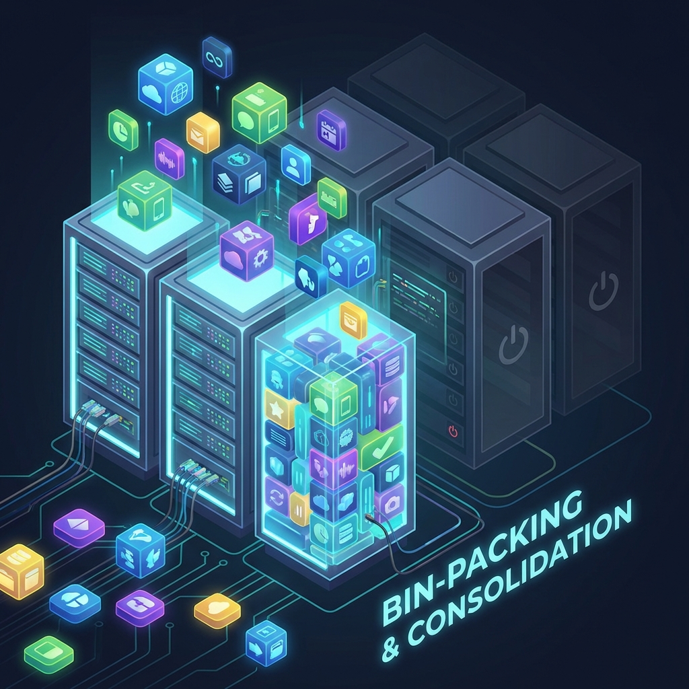

# uk8s & NAP: Intelligent Node Provisioning


## Overview

The **uk8s platform (Shared K8s)** leverages **Node Auto Provisioning (NAP)** (powered by Karpenter) to provide a highly efficient, cost-effective, and automated infrastructure for our shared Kubernetes clusters.

By abstracting complex scheduling requirements behind a simple `workload-type` label, we ensure that every application lands on the optimal compute hardware without developers needing to manage intricate node selectors, affinities, or tolerations.

---

## Key Benefits of NAP

### 1. 🚀 Just-in-Time Provisioning
NAP eliminates the need for massive, static node pools running individually. Instead, it observes pending pods and provisions the **exact** compute resources needed in seconds. This reduces pod startup times and ensures resources are always available when requested.

### 2. 💰 Significant Cost Optimization



- **Right-Sizing**: Nodes are chosen to match the specific request of the pods, minimizing waste (bin-packing).
- **Spot Instance Utilization**: Non-critical workloads are automatically routed to Spot instances, offering up to **90% cost savings** compared to on-demand pricing.
- **Auto-Consolidation**: NAP continuously monitors the cluster. If nodes are underutilized, workloads are consolidated, and expensive nodes are spun down.

### 3. 🎯 Simplified Developer Experience
Developers no longer need to understand the underlying infrastructure or manually configure node affinities. They simply define the **intent** of their workload (e.g., "This provides infrastructure," "This is a batch job"), and the platform handles the rest.

---

## Automated Workload Placement via Kyverno

We use **Kyverno** policies to act as an admission controller and mutation webhook. This automation intercepts pod creations and applies the necessary configurations based on a high-level label: `workload-type`.

### How It Works


1. **Labeling**: A user applies the label `workload-type: <type>` to their Pod or Deployment.
2. **Mutation**: Kyverno detects the label and automatically injects:
   - **Tolerations**: Allowing the pod to schedule on tainted nodes (e.g., spot nodes, specialized hardware).
   - **Node Selectors / Affinities**: Directing the pod to the appropriate NodePool (e.g., High Performance, General Purpose).
   - **Resource Requests/Limits**: (Optional) Enforcing baseline standards for specific workload types.

### Supported Workload Types

| Workload Type | Description | Target Node Characteristics | Use Cases |
| :--- | :--- | :--- | :--- |
| **`spot`** | Cost-optimized, interruptible scheduling. | **Spot Instances** (D/E Series). High-risk of eviction but lowest cost. | CI/CD runners, batch processing, development environments, stateless microservices. |
| **`on-demand`** | Standard robust scheduling. | **On-Demand Instances**. Standard SLAs and guarantees. | Critical production services, databases, stateful applications. |
| **`high-performance`** | Compute-heavy workloads. | **F-Series** (Compute Optimized) or specialized CPUs. High CPU-to-memory ratio. | AI/ML inference, video transcoding, complex calculations. |
| **`infra`** | Platform-critical components. | **System/Infra Nodes**. Isolated from application tenants. | Ingress controllers, service mesh components, logging/monitoring agents. |

---

## Implementation Details

The following table illustrates specifically what the Kyverno policy applies for each type:

### `workload-type: spot`
*   **Tolerations**: `sku=spot:NoSchedule`
*   **Node Selector**: `karpenter.sh/capacity-type: spot`

### `workload-type: infra`
*   **Tolerations**: `critical-addons-only:NoSchedule`
*   **Node Selector**: `kubernetes.azure.com/mode: system`

### `workload-type: high-performance`
*   **Node Selector**: `karpenter.azure.com/sku-family: F`

*(Note: Actual policy details vary based on active cluster configuration.)*

### Example Kyverno ClusterPolicy

```yaml
apiVersion: kyverno.io/v1
kind: ClusterPolicy
metadata:
  name: workload-type-spot-mutation
  annotations:
    policies.kyverno.io/title: Spot Workload Placement
    policies.kyverno.io/description: >-
      Automatically configures pods with workload-type=spot to schedule
      on Spot instances with appropriate tolerations.
spec:
  rules:
    - name: add-spot-tolerations-and-selectors
      match:
        any:
          - resources:
              kinds:
                - Pod
              selector:
                matchLabels:
                  workload-type: spot
      mutate:
        patchStrategicMerge:
          spec:
            tolerations:
              - key: "kubernetes.azure.com/scalesetpriority"
                operator: "Equal"
                value: "spot"
                effect: "NoSchedule"
              - key: "sku"
                operator: "Equal"
                value: "spot"
                effect: "NoSchedule"
            nodeSelector:
              karpenter.sh/capacity-type: spot
```

### Example Kyverno Policy for Infra Workloads

```yaml
apiVersion: kyverno.io/v1
kind: ClusterPolicy
metadata:
  name: workload-type-infra-mutation
spec:
  rules:
    - name: add-infra-tolerations
      match:
        any:
          - resources:
              kinds:
                - Pod
              selector:
                matchLabels:
                  workload-type: infra
      mutate:
        patchStrategicMerge:
          spec:
            tolerations:
              - key: "CriticalAddonsOnly"
                operator: "Exists"
            nodeSelector:
              kubernetes.azure.com/mode: system
```

---

## 🔍 Verifying Workload Placement

### Check Pod Placement

```bash
# See which node your pod landed on
kubectl get pods -n <namespace> -o wide

# Verify the node has expected labels
kubectl get node <node-name> --show-labels | grep -E 'karpenter|capacity-type|sku'

# Check if Kyverno mutation was applied
kubectl get pod <pod-name> -n <namespace> -o yaml | grep -A 10 tolerations
kubectl get pod <pod-name> -n <namespace> -o yaml | grep -A 5 nodeSelector
```

### View NAP/Karpenter Activity

```bash
# See Karpenter provisioner decisions
kubectl logs -n karpenter -l app.kubernetes.io/name=karpenter -c controller | grep -i provisioning

# View NodePool status
kubectl get nodepools -A
kubectl describe nodepool <name>

# See all nodes provisioned by Karpenter
kubectl get nodes -l karpenter.sh/provisioner-name
```

---

## ⚡ Spot Instance Eviction Handling

### What Happens When Spot Nodes Are Reclaimed?

Azure can reclaim Spot VMs with **30 seconds notice**. NAP handles this gracefully:

1. **Eviction Signal**: Azure sends termination notice
2. **Node Drain**: Karpenter cordons and drains the node
3. **Pod Rescheduling**: Pods are rescheduled to other available nodes
4. **New Node Provisioning**: If needed, NAP provisions replacement capacity

### Best Practices for Spot Workloads

```yaml
# Always set PodDisruptionBudget for critical workloads
apiVersion: policy/v1
kind: PodDisruptionBudget
metadata:
  name: my-app-pdb
spec:
  minAvailable: 1  # Or use maxUnavailable
  selector:
    matchLabels:
      app: my-app
```

**Recommendations:**
- Use **multiple replicas** (minimum 2-3) for spot workloads
- Implement **graceful shutdown** handling (SIGTERM)
- Keep **termination grace period** under 25 seconds
- Use **Pod Topology Spread** to distribute across nodes

### Fallback Behavior

If Spot capacity is unavailable, NAP behavior depends on NodePool configuration:

| Configuration | Behavior |
|:--------------|:---------|
| Spot-only NodePool | Pods remain pending until Spot available |
| Mixed NodePool (`spot, on-demand`) | Falls back to on-demand automatically |
| Separate NodePools | Use pod affinity/anti-affinity for control |

---

## 💵 Cost Visibility

### Tracking Savings by Workload Type

Integrate with **Kubecost** or **OpenCost** to track savings:

```bash
# View cost allocation by label
kubectl cost namespace --show-all-resources -l workload-type

# Export for reporting
kubectl cost node --show-pv --output json > node-costs.json
```

### Key Metrics to Monitor

| Metric | Description | Target |
|:-------|:------------|:-------|
| Spot vs On-Demand Ratio | % of compute on Spot | > 60% for non-prod |
| Node Utilization | Actual usage vs allocatable | > 70% |
| Bin-packing Efficiency | How well pods fill nodes | > 80% |
| Consolidation Events | Nodes terminated due to low usage | Regular activity |

---

## 🔧 Troubleshooting

| Symptom | Cause | Solution |
|:--------|:------|:---------|
| Pod stuck in Pending | No matching NodePool | Check `workload-type` label is valid |
| Pod not on Spot node | Kyverno policy not applied | Verify label on Pod (not just Deployment) |
| Frequent pod evictions | Spot capacity volatile | Consider `on-demand` for stability |
| Node not scaling down | Pods blocking consolidation | Check PDBs, local storage, system pods |
| Wrong node type selected | Multiple NodePools matching | Review NodePool weights and requirements |

### Common Debugging Commands

```bash
# Check why a pod is pending
kubectl describe pod <pod-name> -n <namespace> | grep -A 20 Events

# View Kyverno policy reports
kubectl get policyreport -A
kubectl get clusterpolicyreport

# Check if mutation webhook is working
kubectl get mutatingwebhookconfigurations | grep kyverno

# View Karpenter logs for provisioning issues
kubectl logs -n karpenter -l app.kubernetes.io/name=karpenter --tail=100
```

---

## 📚 Related Documentation

- [VPA + NAP Benefits](../VPA/NAP_VPA_BENEFITS.md) - Vertical Pod Autoscaler integration for optimal resource sizing
- [Karpenter Documentation](https://karpenter.sh/docs/)
- [Azure Spot VMs](https://learn.microsoft.com/en-us/azure/virtual-machines/spot-vms)
- [Kyverno Policies](https://kyverno.io/docs/writing-policies/)

---

## Summary

By combining **NAP's** rapid provisioning with **Kyverno's** intelligent mutation, **uk8s** provides a "Serverless Container" experience. Developers focus on their code and workload requirements, while the platform automatically delivers the most cost-effective, performant, and reliable infrastructure.
