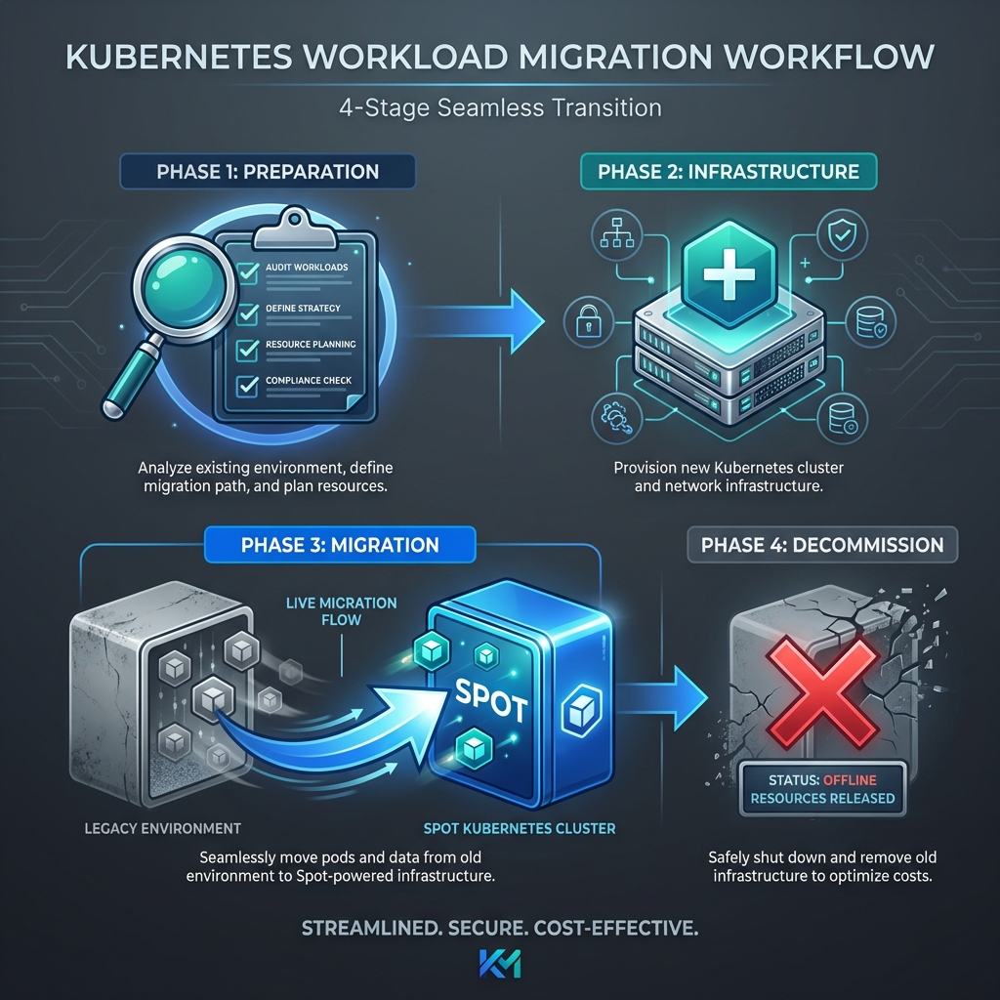

# AKS Spot Node Pool Migration Guide

## Executive Summary

This document outlines the process for migrating dedicated AKS cluster workloads from regular (on-demand) node pools to Azure Spot node pools. Spot instances offer significant cost savings (up to 90%) by utilising unused Azure capacity, with the trade-off that nodes can be evicted when Azure needs the capacity back.

**Key Requirement**: Application teams must update their Kubernetes manifests to include spot node tolerations before regular node pools can be decommissioned.

---

## Table of Contents

1. [Overview](#overview)
2. [Benefits and Considerations](#benefits-and-considerations)
3. [Technical Requirements](#technical-requirements)
4. [Migration Process](#migration-process)
5. [Application Team Actions](#application-team-actions)
6. [Timeline and Phases](#timeline-and-phases)
7. [Risk Mitigation](#risk-mitigation)
8. [FAQ](#faq)

---

## Overview

<!--  -->

### What Are Spot Node Pools?

Azure Spot Virtual Machines allow you to take advantage of unused Azure capacity at significant cost savings. When you deploy a Spot node pool in AKS:

- Nodes are provisioned from Azure's surplus capacity
- Pricing is variable and substantially lower than regular VMs
- Azure can reclaim nodes with approximately 30 seconds notice
- Evicted nodes are automatically replaced when capacity becomes available (with cluster autoscaler enabled)

### Why This Change?

| Driver | Detail |
|--------|--------|
| **Cost Optimisation** | 60-90% reduction in compute costs for eligible workloads |
| **Capacity Efficiency** | Better utilisation of Azure's available resources |
| **Alignment with Workload Profiles** | Many dev/test and batch workloads can tolerate interruption |

---

## Benefits and Considerations

### Benefits

- **Significant cost reduction** for non-critical workloads
- **Automatic scaling** with cluster autoscaler replaces evicted nodes
- **No architectural changes** required beyond toleration configuration

### Considerations

| Aspect | Impact |
|--------|--------|
| **No SLA** | Spot nodes have no availability guarantees |
| **Eviction risk** | Nodes can be reclaimed with ~30 second notice |
| **Capacity variability** | Availability depends on region, VM size, and time of day |
| **Workload suitability** | Not appropriate for all workload types |

### Workloads Suitable for Spot

- Development and testing environments
- Batch processing jobs
- Stateless microservices with proper replica counts
- CI/CD build agents
- Data processing pipelines with checkpointing

### Workloads NOT Suitable for Spot

- Production databases without HA configuration
- Single-replica stateful workloads
- Workloads without graceful shutdown handling
- Time-critical processing with strict SLAs

---

## Technical Requirements

### Spot Node Pool Characteristics

When a spot node pool is created, Azure automatically applies:

| Property | Value |
|----------|-------|
| **Taint** | `kubernetes.azure.com/scalesetpriority=spot:NoSchedule` |
| **Label** | `kubernetes.azure.com/scalesetpriority=spot` |
| **Eviction Policy** | `Delete` (recommended) or `Deallocate` |

### The NoSchedule Taint

The `NoSchedule` taint prevents any pod from being scheduled on spot nodes unless the pod explicitly tolerates it. This is a safety mechanism to ensure only appropriate workloads run on interruptible infrastructure.

**Without the toleration**: Pods remain in `Pending` state and cannot be scheduled.

---

## Migration Process



### High-Level Workflow

```
┌─────────────────────────────────────────────────────────────────────┐
│                                                                     │
│  Phase 1: Preparation                                               │
│  ├── Communicate timeline to application teams                      │
│  ├── Teams assess workload suitability                              │
│  └── Teams update manifests with tolerations                        │
│                                                                     │
│  Phase 2: Infrastructure                                            │
│  ├── Create spot node pool alongside existing regular pool          │
│  ├── Verify spot nodes are healthy                                  │
│  └── Enable cluster autoscaler on spot pool                         │
│                                                                     │
│  Phase 3: Workload Migration                                        │
│  ├── Teams redeploy workloads with tolerations                      │
│  ├── Verify pods schedule on spot nodes                             │
│  └── Monitor for issues                                             │
│                                                                     │
│  Phase 4: Decommission                                              │
│  ├── Cordon regular node pool                                       │
│  ├── Drain regular node pool                                        │
│  └── Delete regular node pool                                       │
│                                                                     │
└─────────────────────────────────────────────────────────────────────┘
```

### Detailed Steps

#### Phase 1: Create Spot Node Pool

```bash
# Set variables
export RESOURCE_GROUP="<resource-group>"
export AKS_CLUSTER="<cluster-name>"
export SPOT_NODEPOOL="spotpool"

# Create the spot node pool
az aks nodepool add \
    --resource-group $RESOURCE_GROUP \
    --cluster-name $AKS_CLUSTER \
    --name $SPOT_NODEPOOL \
    --priority Spot \
    --eviction-policy Delete \
    --spot-max-price -1 \
    --enable-cluster-autoscaler \
    --min-count 1 \
    --max-count 10 \
    --node-vm-size Standard_D4s_v3
```

#### Phase 2: Verify Spot Node Pool

```bash
# Confirm spot configuration
az aks nodepool show \
    --resource-group $RESOURCE_GROUP \
    --cluster-name $AKS_CLUSTER \
    --name $SPOT_NODEPOOL \
    --query "{priority:scaleSetPriority, evictionPolicy:scaleSetEvictionPolicy, taints:nodeTaints}"
```

Expected output:
```json
{
  "priority": "Spot",
  "evictionPolicy": "Delete",
  "taints": ["kubernetes.azure.com/scalesetpriority=spot:NoSchedule"]
}
```

#### Phase 3: Application Teams Update Manifests

See [Application Team Actions](#application-team-actions) section.

#### Phase 4: Decommission Regular Node Pool

```bash
# Cordon the regular node pool (prevent new scheduling)
kubectl cordon -l agentpool=<regular-pool-name>

# Drain workloads from regular nodes
kubectl drain -l agentpool=<regular-pool-name> \
    --ignore-daemonsets \
    --delete-emptydir-data

# Delete the regular node pool
az aks nodepool delete \
    --resource-group $RESOURCE_GROUP \
    --cluster-name $AKS_CLUSTER \
    --name <regular-pool-name>
```

---

## Application Team Actions

### Required Manifest Changes

Application teams must add a toleration to their Deployment, StatefulSet, DaemonSet, or Job specifications:

> **Note:** Kyverno is not available for this process. Automating these changes via mutating admission policies is not possible; teams must manually update their manifests.

#### Minimum Required Change

```yaml
apiVersion: apps/v1
kind: Deployment
metadata:
  name: my-application
spec:
  template:
    spec:
      tolerations:
        - key: "kubernetes.azure.com/scalesetpriority"
          operator: "Equal"
          value: "spot"
          effect: "NoSchedule"
      containers:
        - name: my-container
          image: my-image:latest
```

#### Recommended: Full Spot Configuration

For explicit scheduling control, include node affinity:

```yaml
apiVersion: apps/v1
kind: Deployment
metadata:
  name: my-application
spec:
  replicas: 3  # Multiple replicas recommended for spot
  template:
    spec:
      tolerations:
        - key: "kubernetes.azure.com/scalesetpriority"
          operator: "Equal"
          value: "spot"
          effect: "NoSchedule"
      affinity:
        nodeAffinity:
          requiredDuringSchedulingIgnoredDuringExecution:
            nodeSelectorTerms:
              - matchExpressions:
                  - key: "kubernetes.azure.com/scalesetpriority"
                    operator: In
                    values:
                      - "spot"
        podAntiAffinity:
          preferredDuringSchedulingIgnoredDuringExecution:
            - weight: 100
              podAffinityTerm:
                labelSelector:
                  matchLabels:
                    app: my-application
                topologyKey: "kubernetes.io/hostname"
      terminationGracePeriodSeconds: 30
      containers:
        - name: my-container
          image: my-image:latest
```

### Best Practices for Spot Workloads

| Practice | Rationale |
|----------|-----------|
| **Run multiple replicas** | Ensures availability during evictions |
| **Use Pod Disruption Budgets** | Controls how many pods can be unavailable |
| **Handle SIGTERM gracefully** | Allows clean shutdown on eviction |
| **Set appropriate terminationGracePeriodSeconds** | Azure gives ~30s notice |
| **Spread replicas across nodes** | Pod anti-affinity reduces blast radius |
| **Implement health checks** | Enables quick detection of issues |

### Pod Disruption Budget Example

```yaml
apiVersion: policy/v1
kind: PodDisruptionBudget
metadata:
  name: my-application-pdb
spec:
  minAvailable: 2  # Or use maxUnavailable: 1
  selector:
    matchLabels:
      app: my-application
```

---

## Timeline and Phases

| Phase | Duration | Activities |
|-------|----------|------------|
| **Announcement** | Week 1 | Communicate migration plan to all teams |
| **Preparation** | Weeks 2-4 | Teams assess workloads and update manifests |
| **Infrastructure** | Week 5 | Create spot node pools on target clusters |
| **Migration Window** | Weeks 6-8 | Teams redeploy with tolerations |
| **Validation** | Week 9 | Verify all workloads running on spot nodes |
| **Decommission** | Week 10 | Remove regular node pools |

---

## Risk Mitigation

### What Happens If Teams Don't Update Manifests?

If the regular node pool is deleted before workloads have the spot toleration:

```
$ kubectl get pods
NAME                            READY   STATUS    RESTARTS   AGE
my-application-7d9f8b6c4-xxxxx  0/1     Pending   0          5m

$ kubectl describe pod my-application-7d9f8b6c4-xxxxx
Events:
  Warning  FailedScheduling  0/3 nodes are available: 3 node(s) had 
           untolerated taint {kubernetes.azure.com/scalesetpriority: spot}
```

**Result**: Workloads cannot schedule and remain in Pending state until tolerations are added.

### Mitigation Strategies

> **Note:** Kyverno is not available for this process. Automated policy enforcement is not possible, so we rely on the following manual validation steps.

1. **Validation Gate**: Before decommissioning regular pools, verify all deployments have tolerations:
   ```bash
   kubectl get deployments -A -o json | jq -r '.items[] | select(.spec.template.spec.tolerations == null or (.spec.template.spec.tolerations | map(select(.key == "kubernetes.azure.com/scalesetpriority")) | length == 0)) | "\(.metadata.namespace)/\(.metadata.name)"'
   ```

2. **Phased Rollout**: Migrate cluster by cluster, starting with non-critical environments

3. **Communication**: Clear deadlines with escalation for non-compliant teams

4. **Rollback Plan**: Retain ability to quickly recreate regular node pool if critical issues arise

---

## FAQ

### Q: Can we remove the taint from spot node pools?

No. The `kubernetes.azure.com/scalesetpriority=spot:NoSchedule` taint is automatically applied by AKS and cannot be removed from spot node pools.

### Q: What if our workload can't tolerate evictions?

Consider keeping a small regular node pool for critical workloads, or evaluate whether the workload can be re-architected to handle interruptions gracefully.

### Q: How much notice do we get before eviction?

Approximately 30 seconds. Azure sends a scheduled event that the node can detect, but there's no guarantee of graceful migration time.

### Q: Will pods automatically move to spot nodes after adding tolerations?

No. Existing pods continue running on their current nodes. You must trigger a rollout:
```bash
kubectl rollout restart deployment/<name>
```

### Q: What does `spot-max-price: -1` mean?

Setting max price to -1 means you're willing to pay up to the on-demand price. The node won't be evicted due to price (only capacity), giving maximum availability within spot constraints.

### Q: Can the system node pool be spot?

No. Spot node pools can only be secondary (User mode) pools. The default/system node pool must remain Regular priority.

---

## Support and Contacts

For questions or issues during migration:

- **Platform Team**: [Contact details]
- **Migration Support Channel**: [Slack/Teams channel]
- **Documentation**: [Internal wiki link]

---

## Revision History

| Version | Date | Author | Changes |
|---------|------|--------|---------|
| 1.0 | January 2026 | Platform Team | Initial release |