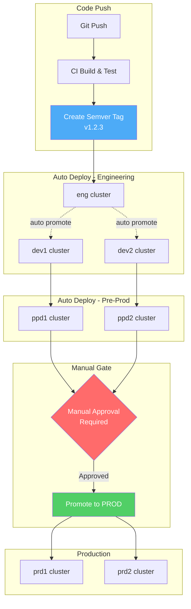

I'll create a quick CD release flow diagram for you:



## Quick Release Guide

**1. Dev commits → Auto Release**
```bash
git tag v1.2.3
git push --tags
```

**2. Automatic Flow:**
- ✅ **eng** → auto deploy
- ✅ **dev1, dev2** → auto deploy (after eng validation)
- ✅ **ppd1, ppd2** → auto deploy (after dev validation)

**3. Manual Gate for Production:**
```bash
# Approve via GitOps/Argo
# Update prod overlays to v1.2.3
kubectl apply -k overlays/prd1
```

**4. Decoupled Components:**
Each component uses independent semver:
- `frontend: v1.2.3`
- `backend-api: v2.1.0`
- `worker: v1.5.2`

**Key Points:**
- 🏷️ Semver tags trigger deployments
- 🔄 Auto-promote through lower envs
- 🛑 Manual approval gate before prod
- 🎯 Each cluster can run different versions
- 📦 Components versioned independently